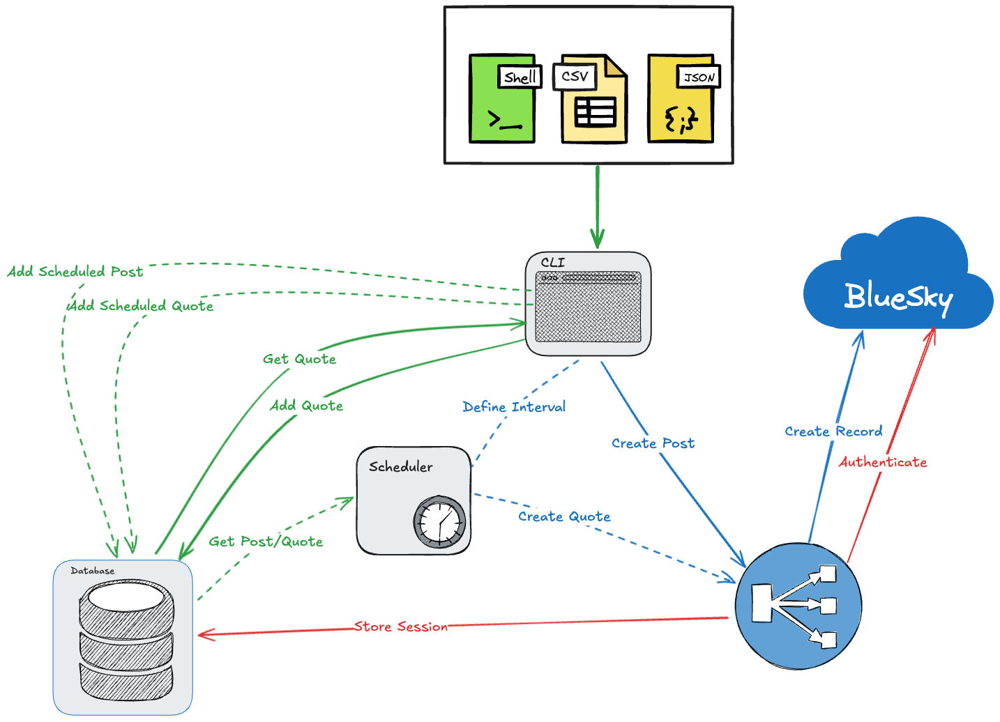

# QuoteSky

| Drawing |
| --- |
|  |

## Protocol

- `QUOTE:POST` – Posts a random quote.
- `QUOTE:GET` – Gets a random quote.
- `QUOTE:LIST` – Lists all quotes.
- `QUOTE:ADD <quote>` – Adds a new quote.
- `QUOTE:REMOVE <quote>` – Removes a quote.
- `QUOTE:UPDATE <quote>` – Updates a quote.

## Setup

1. Clone the repository
2. Create a `.env` file in the root directory and add the following:

```bash
touch .env
echo "BLUESKY_HANDLE=<your_handle>" >> .env
echo "BLUESKY_PASSWORD=<your_password>" >> .env
```

## Running the project

1. Install the dependencies

```bash
go mod download
```

Build the project

```bash
mkdir -p tmp
go build -o ./tmp/quotesky ./...
```

Run the CLI

```bash
./tmp/quotesky --help
```
